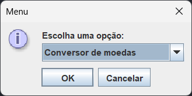

# Conversor de Moedas #

## 📝 Descrição do projeto ##

Projeto criado para o desafio da Alura em conjunto com a Oracle, no Challenge ONE. #challengeOneConversor5

## 🔧 Ferramentas e tecnologias ##

* Java
* Java Swing

## 📌 Funcionalidades ##

O objetivo do projeto é criar um conversor de moedas que realize as conversões de reais para várias outras moedas, assim como a conversão inversa também deve acontecer.
Um desafio extra é adicionar outro conversor a este (em andamento.)

## 👩🏻‍💻 Feito por ##

Desenvolvido com ♥ por [Bruna Soncini](www.linkedin.com/in/brunasoncini/).

